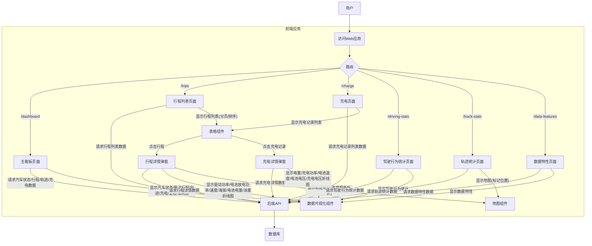

# 数据收集平台设计与开发计划

## 1. 项目目标
设计并实现一个数据收集平台，具备以下核心功能：
- MQTT数据采集：通过MQTT服务端接收数据，并提供测试客户端模拟数据发送。
- 数据处理：对采集到的数据进行实时处理和分析。
- 数据持久化：将原始数据和分析结果分别存储到合适的数据库。
- 数据可视化：通过Vue前端展示数据和分析结果。

## 2. 技术栈概览
- **MQTT Broker**: EMQX (已通过 `docker-compose.yml` 提供)
- **原始数据存储**: InfluxDB (已通过 `docker-compose.yml` 提供)
- **分析结果存储**: PostgreSQL (已通过 `docker-compose.yml` 提供)
- **数据分析后台服务**: Golang (负责从InfluxDB提取数据、分析、并将结果写入PostgreSQL，并提供API，包括前端数据查询API)
- **前端**: Vue.js (负责数据可视化展示)

## 3. 数据流设计

```mermaid
graph TD
    A[log/type_and_keys.txt] --> B{数据解析与假数据生成};
    B --> C[MQTT测试客户端];
    C -- 发布数据 --> D[EMQX MQTT服务端];
    D -- 监听数据 --> G[Golang数据分析后台服务];
    G -- 写入原始数据 --> F1[InfluxDB];
    G -- 根据事件状态动态触发数据分析 --> G;
    G -- 写入分析结果 --> F2[PostgreSQL];
    F2 -- 提供API --> H[Vue数据可视化前端];
    H -- 请求数据 --> G;

## 4. 前端API设计

为了支持Vue前端的数据可视化，`data_analyzer` 服务将提供以下API端点：

### 获取行程数据列表

*   **端点**: `/api/trips`
*   **方法**: `GET`
*   **参数**:
    *   `start_time` (可选): 查询的开始时间，例如 `YYYY-MM-DDTHH:MM:SSZ` 格式。
    *   `end_time` (可选): 查询的结束时间，例如 `YYYY-MM-DDTHH:MM:SSZ` 格式。
    *   `limit` (可选): 返回的记录数限制，默认为 10。
    *   `offset` (可选): 查询的偏移量，用于分页，默认为 0。
*   **响应**: JSON 格式的行程数据列表。

```json
[
  {
    "id": 1,
    "start_time": "2025-07-15T10:00:00Z",
    "end_time": "2025-07-15T10:30:00Z",
    "start_location": "Location A",
    "end_location": "Location B",
    "avg_speed": 60.5,
    "avg_power": 25.3
  }
]
```

## 5. 详细工作计划 (TODO List)
    I[docker-compose.yml] --> D;
    I --> F1;
    I --> F2;
```

## 4. 前端设计

### 4.1 页面划分与功能

根据需求，前端页面将划分为以下几个主要部分：

1.  **主看板页面 (`/dashboard`)**
    *   **功能**: 显示汽车状态信息、最近行程信息、最近轨迹信息、最近充电信息、里程历史折线图、油耗折线图等。
    *   **组件**: 汽车状态卡片、最近行程/充电列表、图表组件（里程/油耗）、地图组件（最近轨迹）。

2.  **行程列表页面 (`/trips`)**
    *   **功能**: 显示行程列表，行程信息包括行程起止时间、起止位置、里程、油耗、电耗。
    *   **交互**: 默认按行程起始时间排序，可自定义排序；页面支持分页显示（每页10/20/50/100条）；点击指定行程可显示行程详情弹窗。
    *   **组件**: 行程列表表格、分页器、排序选择器。

3.  **行程详情弹窗 (Modal)**
    *   **功能**: 显示单次行程详情，以图表形式展示驱动功率、电池放电功率、速度、海拔、电池电量、油量随时间的折线图；显示轨迹地图，通过轨迹颜色标识实时速度（红快蓝慢）。
    *   **组件**: 多个折线图组件、地图组件。

4.  **充电页面 (`/charge`)**
    *   **功能**: 显示充电记录列表，信息包括：充电起止时间、充电位置、充电起止电量、充入电量、充电类型（交/直流）。
    *   **交互**: 点击对应条目可以显示充电详情弹窗。
    *   **组件**: 充电记录列表表格。

5.  **充电详情弹窗 (Modal)**
    *   **功能**: 显示电量折线图、充电功率折线图、电池温度折线图、电池电压折线图、充电电压折线图。
    *   **组件**: 多个折线图组件。

6.  **驾驶行为统计页面 (`/driving-stats`)**
    *   **功能**: 显示周期内的驾驶次数、驾驶里程、驾驶油耗、驾驶电耗、平均里程、平均油耗、平均电耗。
    *   **组件**: 统计数据展示卡片、时间范围选择器。

7.  **轨迹统计页面 (`/track-stats`)**
    *   **功能**: 显示地图，在地图上标记以下位置：当前停留位置、常去TOP10目的地、常停留TOP10位置、常充电位置。
    *   **组件**: 地图组件（带标记点）。

8.  **数据特性页面 (`/data-features`)**
    *   **功能**: 其他的数据分析结果，如在指定区域/路段的平均速度。
    *   **组件**: 根据具体分析结果定制的图表或表格。

### 4.2 前端技术选型

*   **框架**: Vue.js 3
*   **UI组件库**: Element Plus / Ant Design Vue (待定，根据项目现有引入情况或偏好选择)
*   **图表库**: Echarts / AntV G2
*   **地图SDK**: 高德地图API / 百度地图API
*   **路由**: Vue Router
*   **状态管理**: Pinia / Vuex

### 4.3 页面流程图



## 5. 后端数据库设计

根据前端页面需求和现有技术栈（InfluxDB用于原始时序数据，PostgreSQL用于分析结果和结构化数据），设计以下数据库表结构：

### 5.1 PostgreSQL 数据库表结构

PostgreSQL 将存储结构化、关系型数据，如行程信息、充电记录、统计结果等。

1.  **`vehicles` 表 (车辆信息)**
    *   `id` (UUID/BIGINT, PRIMARY KEY) - 车辆唯一标识
    *   `name` (VARCHAR) - 车辆名称
    *   `vin` (VARCHAR, UNIQUE) - 车辆识别码
    *   `created_at` (TIMESTAMP) - 创建时间
    *   `updated_at` (TIMESTAMP) - 更新时间

2.  **`trips` 表 (行程信息)**
    *   `id` (UUID/BIGINT, PRIMARY KEY) - 行程唯一标识
    *   `vehicle_id` (UUID/BIGINT, FOREIGN KEY references `vehicles.id`) - 车辆ID
    *   `start_time` (TIMESTAMP) - 行程开始时间
    *   `end_time` (TIMESTAMP) - 行程结束时间
    *   `start_latitude` (NUMERIC) - 行程开始纬度
    *   `start_longitude` (NUMERIC) - 行程开始经度
    *   `end_latitude` (NUMERIC) - 行程结束纬度
    *   `end_longitude` (NUMERIC) - 行程结束经度
    *   `total_mileage` (NUMERIC) - 总里程
    *   `total_fuel_consumption` (NUMERIC) - 总油耗
    *   `total_electric_consumption` (NUMERIC) - 总电耗
    *   `avg_speed` (NUMERIC) - 平均速度
    *   `max_speed` (NUMERIC) - 最大速度
    *   `avg_power` (NUMERIC) - 平均功率
    *   `created_at` (TIMESTAMP) - 创建时间

3.  **`charges` 表 (充电记录)**
    *   `id` (UUID/BIGINT, PRIMARY KEY) - 充电记录唯一标识
    *   `vehicle_id` (UUID/BIGINT, FOREIGN KEY references `vehicles.id`) - 车辆ID
    *   `start_time` (TIMESTAMP) - 充电开始时间
    *   `end_time` (TIMESTAMP) - 充电结束时间
    *   `charge_latitude` (NUMERIC) - 充电位置纬度
    *   `charge_longitude` (NUMERIC) - 充电位置经度
    *   `start_soc` (NUMERIC) - 充电开始电量 (State of Charge)
    *   `end_soc` (NUMERIC) - 充电结束电量
    *   `charged_kwh` (NUMERIC) - 充入电量 (kWh)
    *   `charge_type` (VARCHAR) - 充电类型 ('AC' 或 'DC')
    *   `created_at` (TIMESTAMP) - 创建时间

4.  **`driving_stats` 表 (驾驶行为统计)**
    *   `id` (UUID/BIGINT, PRIMARY KEY) - 统计记录唯一标识
    *   `vehicle_id` (UUID/BIGINT, FOREIGN KEY references `vehicles.id`) - 车辆ID
    *   `stat_date` (DATE) - 统计日期
    *   `period_type` (VARCHAR) - 统计周期类型 ('daily', 'weekly', 'monthly')
    *   `driving_count` (INTEGER) - 驾驶次数
    *   `total_mileage` (NUMERIC) - 总里程
    *   `total_fuel_consumption` (NUMERIC) - 总油耗
    *   `total_electric_consumption` (NUMERIC) - 总电耗
    *   `avg_mileage_per_drive` (NUMERIC) - 单次驾驶平均里程
    *   `avg_fuel_consumption_per_drive` (NUMERIC) - 单次驾驶平均油耗
    *   `avg_electric_consumption_per_drive` (NUMERIC) - 单次驾驶平均电耗
    *   `created_at` (TIMESTAMP) - 创建时间

5.  **`location_stats` 表 (轨迹统计位置)**
    *   `id` (UUID/BIGINT, PRIMARY KEY) - 位置统计唯一标识
    *   `vehicle_id` (UUID/BIGINT, FOREIGN KEY references `vehicles.id`) - 车辆ID
    *   `location_type` (VARCHAR) - 位置类型 ('current_stop', 'top_destination', 'top_stay', 'charge_location')
    *   `name` (VARCHAR) - 位置名称或描述
    *   `latitude` (NUMERIC) - 纬度
    *   `longitude` (NUMERIC) - 经度
    *   `count` (INTEGER) - 统计次数
    *   `created_at` (TIMESTAMP) - 创建时间

6.  **`data_features` 表 (数据特性分析结果)**
    *   `id` (UUID/BIGINT, PRIMARY KEY) - 特性分析结果唯一标识
    *   `vehicle_id` (UUID/BIGINT, FOREIGN KEY references `vehicles.id`) - 车辆ID
    *   `feature_type` (VARCHAR) - 特性类型 (例如 'avg_speed_in_area')
    *   `feature_value` (NUMERIC) - 特性值
    *   `start_time` (TIMESTAMP) - 分析开始时间
    *   `end_time` (TIMESTAMP) - 分析结束时间
    *   `area_info` (JSONB) - 区域或路段的详细信息，例如GeoJSON
    *   `created_at` (TIMESTAMP) - 创建时间

### 5.2 InfluxDB 数据模型

InfluxDB 将主要存储原始的时序数据，例如车辆传感器数据、行程中的详细数据点、充电过程中的详细数据点。

1.  **`vehicle_telemetry` 测量 (汽车实时遥测数据)**
    *   **Tags**: `vehicle_id`
    *   **Fields**: `latitude`, `longitude`, `speed`, `mileage`, `fuel_level`, `soc`, `battery_temp`, `charge_status`, `power`, `altitude`, `oil_level` 等 (具体字段根据实际MQTT数据定义)

2.  **`trip_details` 测量 (行程详情数据点)**
    *   **Tags**: `vehicle_id`, `trip_id`
    *   **Fields**: `drive_power`, `discharge_power`, `speed`, `altitude`, `soc`, `fuel_level`, `latitude`, `longitude` 等 (具体字段根据实际MQTT数据定义)

3.  **`charge_details` 测量 (充电详情数据点)**
    *   **Tags**: `vehicle_id`, `charge_id`
    *   **Fields**: `soc`, `charge_power`, `battery_temp`, `battery_voltage`, `charge_voltage` 等 (具体字段根据实际MQTT数据定义)

## 6. 详细工作计划 (TODO List)

以下是按照逻辑顺序排列的详细工作计划：

- [x] 确认log/type_and_keys.txt的完整解析规则和数据类型推断。
- [x] 启动docker-compose.yml中的所有服务，并验证其正常运行。
- [x] 设计MQTT测试客户端的数据生成逻辑，根据type_and_keys.txt生成假数据。
- [x] 开发MQTT测试客户端。
- [x] **验证MQTT客户端发送的数据是否被EMQX正确接收（通过EMQX Dashboard或订阅工具）**。
- [x] 实现MQTT Subscriber服务（Golang服务），监听EMQX数据并持久化到InfluxDB。
- [x] 设计数据分析后台服务（Golang服务），包括根据事件状态动态触发数据分析和API接口。
- [x] 实现数据分析后台服务（Golang服务），从InfluxDB提取数据，根据事件状态进行行车数据分析。
- [x] 实现数据分析后台服务（Golang服务），将分析结果写入PostgreSQL。
- [x] 测试数据分析后台服务的数据处理和持久化。
[x] 详细分析前端页面需求并进行设计。
[-] 详细分析后端数据库需求并进行设计。
[ ] 详细分析后端接口需求并进行设计。
[ ] 将设计方案写入 plan.md。
[ ] 询问用户是否满意设计方案。

## 5. 阶段性可测试性保证

每个阶段的完成都将伴随严格的测试，确保数据链路的完整性和功能的正确性：
- **MQTT测试客户端完成后**：测试MQTT客户端与EMQX服务端的数据可达性。**验证方法包括：使用EMQX Dashboard查看消息，或使用其他MQTT客户端工具订阅相应Topic。**
- **Golang数据分析后台服务完成后**：测试MQTT Subscriber服务是否能正确接收EMQX数据并持久化到InfluxDB，以及数据分析任务是否能根据事件状态动态触发并写入PostgreSQL，并验证API接口的可用性。
- **Vue前端完成后**：测试前端页面能否正确通过API获取数据并进行可视化展示。

## 6. 项目目录布局
项目将遵循现有目录结构，新创建的文件和模块将放置在逻辑上最合适的目录下。例如：
- MQTT测试客户端：可能在 `tools/` 或新创建的 `mqtt-client/` 目录下。
- Golang后台服务：可能在 `backend/golang/` 目录下。
- Vue前端：在 `frontend/` 目录下。

## 7. 后端接口设计

后端接口将由 Golang 数据分析后台服务提供，用于前端获取数据。接口设计遵循 RESTful 风格，并考虑数据的查询、过滤、分页和排序需求。

### 7.1 API 列表

1.  **获取汽车状态信息**
    *   **端点**: `/api/vehicle/status`
    *   **方法**: `GET`
    *   **参数**: `vehicle_id` (可选，如果未提供则返回所有车辆的最新状态或默认车辆状态)
    *   **响应**: 最新汽车状态信息，例如：
        ```json
        {
          "vehicle_id": "uuid-123",
          "timestamp": "2025-07-15T11:00:00Z",
          "latitude": 34.0522,
          "longitude": -118.2437,
          "speed": 60.5,
          "mileage": 12345.6,
          "fuel_level": 75.0,
          "soc": 80.0,
          "battery_temp": 25.0,
          "charge_status": "charging",
          "power": 15.0
        }
        ```

2.  **获取行程列表**
    *   **端点**: `/api/trips`
    *   **方法**: `GET`
    *   **参数**:
        *   `vehicle_id` (可选)
        *   `start_time` (可选): 查询的开始时间 (ISO 8601 格式)
        *   `end_time` (可选): 查询的结束时间 (ISO 8601 格式)
        *   `page` (可选): 页码，默认为1
        *   `page_size` (可选): 每页显示条数，可选10/20/50/100，默认为10
        *   `sort_by` (可选): 排序字段，例如 `start_time`, `total_mileage`, `total_fuel_consumption`
        *   `sort_order` (可选): 排序顺序，`asc` 或 `desc`，默认为 `desc`
    *   **响应**: 行程数据列表，包含分页信息：
        ```json
        {
          "total": 100,
          "page": 1,
          "page_size": 10,
          "data": [
            {
              "id": "trip-uuid-1",
              "vehicle_id": "uuid-123",
              "start_time": "2025-07-15T10:00:00Z",
              "end_time": "2025-07-15T10:30:00Z",
              "start_location": "Location A",
              "end_location": "Location B",
              "total_mileage": 50.2,
              "total_fuel_consumption": 5.5,
              "total_electric_consumption": 10.2
            }
          ]
        }
        ```

3.  **获取单次行程详情**
    *   **端点**: `/api/trips/{trip_id}/details`
    *   **方法**: `GET`
    *   **参数**: `trip_id` (路径参数)
    *   **响应**: 单次行程的详细数据点列表，用于绘制折线图和轨迹地图：
        ```json
        [
          {
            "timestamp": "2025-07-15T10:00:00Z",
            "drive_power": 20.5,
            "discharge_power": 5.0,
            "speed": 60.0,
            "altitude": 100.0,
            "soc": 80.0,
            "fuel_level": 75.0,
            "latitude": 34.0522,
            "longitude": -118.2437
          }
        ]
        ```

4.  **获取充电记录列表**
    *   **端点**: `/api/charges`
    *   **方法**: `GET`
    *   **参数**:
        *   `vehicle_id` (可选)
        *   `start_time` (可选)
        *   `end_time` (可选)
        *   `page` (可选)
        *   `page_size` (可选)
        *   `sort_by` (可选): `start_time`, `charged_kwh`
        *   `sort_order` (可选)
    *   **响应**: 充电记录列表，包含分页信息：
        ```json
        {
          "total": 50,
          "page": 1,
          "page_size": 10,
          "data": [
            {
              "id": "charge-uuid-1",
              "vehicle_id": "uuid-123",
              "start_time": "2025-07-14T08:00:00Z",
              "end_time": "2025-07-14T09:00:00Z",
              "charge_location": "Charging Station A",
              "start_soc": 20.0,
              "end_soc": 90.0,
              "charged_kwh": 50.0,
              "charge_type": "DC"
            }
          ]
        }
        ```

5.  **获取单次充电详情**
    *   **端点**: `/api/charges/{charge_id}/details`
    *   **方法**: `GET`
    *   **参数**: `charge_id` (路径参数)
    *   **响应**: 单次充电的详细数据点列表，用于绘制折线图：
        ```json
        [
          {
            "timestamp": "2025-07-14T08:00:00Z",
            "soc": 20.0,
            "charge_power": 50.0,
            "battery_temp": 30.0,
            "battery_voltage": 400.0,
            "charge_voltage": 450.0
          }
        ]
        ```

6.  **获取驾驶行为统计数据**
    *   **端点**: `/api/driving-stats`
    *   **方法**: `GET`
    *   **参数**:
        *   `vehicle_id` (可选)
        *   `start_date` (可选): 统计开始日期 (YYYY-MM-DD 格式)
        *   `end_date` (可选): 统计结束日期 (YYYY-MM-DD 格式)
        *   `period_type` (可选): 统计周期类型 ('daily', 'weekly', 'monthly')，默认为 'daily'
    *   **响应**: 驾驶行为统计数据列表：
        ```json
        [
          {
            "stat_date": "2025-07-01",
            "driving_count": 5,
            "total_mileage": 200.0,
            "total_fuel_consumption": 20.0,
            "total_electric_consumption": 40.0,
            "avg_mileage_per_drive": 40.0,
            "avg_fuel_consumption_per_drive": 4.0,
            "avg_electric_consumption_per_drive": 8.0
          }
        ]
        ```

7.  **获取轨迹统计数据**
    *   **端点**: `/api/location-stats`
    *   **方法**: `GET`
    *   **参数**:
        *   `vehicle_id` (可选)
        *   `location_type` (可选): 'current_stop', 'top_destination', 'top_stay', 'charge_location'
    *   **响应**: 轨迹统计位置列表：
        ```json
        [
          {
            "location_type": "top_destination",
            "name": "Home",
            "latitude": 34.123,
            "longitude": -118.456,
            "count": 10
          }
        ]
        ```

8.  **获取数据特性分析结果**
    *   **端点**: `/api/data-features`
    *   **方法**: `GET`
    *   **参数**:
        *   `vehicle_id` (可选)
        *   `feature_type` (可选): 例如 'avg_speed_in_area'
        *   `start_time` (可选)
        *   `end_time` (可选)
    *   **响应**: 数据特性分析结果列表：
        ```json
        [
          {
            "feature_type": "avg_speed_in_area",
            "feature_value": 50.0,
            "area_info": { "name": "Downtown", "geojson": "..." }
          }
        ]
        ```